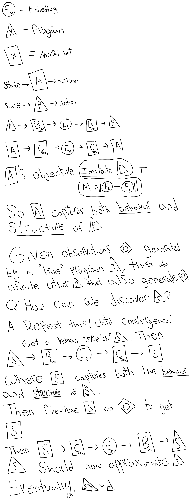

### The Future of Agent-Based Modeling

So many problems in industry, science, and governance can be framed as two questions: “How can we understand this large, heterogeneous group of people’s behavior?” and “How can we use that understanding to influence it?”. Philosophers and executives use their experience and intuitions to answer these. Social scientists and data analysts help them bolster those intuitions with more systematic, empirical evidence. But even with all the studies in the world, it’s difficult for anyone to reliably calibrate their intuitions and efficiently take their assumptions to their limits. Agent-based simulations automate this work and can _literally_ scale this process to all the studies in the world and evolve every assumption to its conclusion.

This sounds amazing. If we had tools for everyone to answer their questions with agent-based simulations, it would be as big a boon to social engineering as roman numerals were to arithmetic. That thinking led me to create AgentMaps, a way to easily simulate a large, heterogenous group of people anywhere on a map. It quickly became the most popular ABM framework on GitHub and I started getting flooded with emails from people trying to apply ABMs to their work. Over the years, I’ve spoken and consulted with hundreds of people using agent-based simulations in every field from behavioral finance to gaming to archaeology. And the truth dawned on me:

It’s mostly useless. Pretty. Useful for persuasion. But for solving the problems of industry, science, and governance that inspired me at first? Not so much. The latest, most disappointing examples have been in the public eye: large, reputed public health institutions using poorly calibrated, misspecified ABMs to justify risky covid-19 measures. Papers were published, they got lots of media attention, grants were paid out, the authors got lucrative consulting gigs—but the assumptions were _completely_ misspecified and the results won’t have any impact on the problems at hand. As the stakes change from public health to private business, ABMs tend to be used to make or justify arbitrary decisions with a veneer of technicality.

The places where ABMs tend to be legitimately useful are in areas like supply-chain and transportation management, where behavior tends to be heavily streamlined and constrained, and variations within those constraints still have large, out-sized effects. But operations engineers have been optimizing supply-chains and transportation systems for a long, _long_ time and historically had a name for this kind of work: multi-agent simulations. It’s a one word difference, but it carries a load. To me, the aspiration of agent-based models is to understand and influence complex social arrangements in every industry and sector, far beyond the cogs-in-a-machine domain of multi-agent systems.

So is the aspirational failure of ABM just a failure of incentives? Are the simulation designers helpless against the pressure to produce or justify an answer as fast as possible? Or is it a failure of talent? Are the simulation designers just too lazy or uninformed to design good, calibrated models?

The answer is none of these. Even if your simulation designers are motivated, informed, and incentivized to get it right, the results will probably be disappointing. Most simulation designers aren’t experts on human behavior in general, let alone any behavior in particular. And even a difference in one behavior out of a hundred can make a model diverge dramatically from reality.

But then _who_ are the experts in human behavior? Even behavioral psychologists who dedicate their lives to empirically studying and cataloguing human behaviors are _notorious_ for endorsing inaccurate claims about the topic. So how can we expect simulation designers to do any better? We can’t.

The subjects of agent-based models are intractable for most designers to model today. There is no tool to automate this process like Autodesk does for FEA and Photoshop does for visual editing. That process _is not_ turning an english-language description of the model into ABM code. It’s the modeling itself.

How could we actually go about doing that? At a high level, modelers take their observations and formalize them into an ABM, so we want a tool that takes observations and does the same. But there are infinite distinct agent-based models that generate the same observations, and the behaviors they assume can be drastically different. The problem is as intractable to fully automate as it is to manually model, just for different reasons.

The future of ABM is a partnership between automatic optimizers and faulty human modelers. While human modelers and simulation designers can’t get the details exactly right, they tend to have accurate, high-level intuitions about what’s going on. Instead of generating models from observations from scratch, a human can seed an optimizer with intuitive, hand-crafted models. Then, our optimizer can automatically search the space around those models and sculpt them to better fit our observations. But again, there are many possibilities that can vary drastically, so the process doesn’t stop there. Our human modelers can then evaluate and refine the machine-generated models with their own intuitions to further align them with reality. They can then feed them back into the optimizer for further, automatic refinement.

I expect this feedback loop between automatic optimization and human intuition to thoroughly blast away the obstacles that have been in the way of ABM so far.
To be sure, this is a research problem, not a hack.
There are lots of ways to synthesize ABMs, the most common one being evolutionary programming.
The real way forward is probably very different and may involve neural embeddings of ABMs and a dose of metalearning, an idea which I'll sketch a little below. I’ve been distracted by personal matters, but I strongly encourage anyone in this area to pursue this problem if they truly want to move ABM from a rebranding of MAS into a genuine boon for industry and society.

