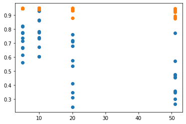

### **Augmenting Latent Space Optimization with Evolution**

### **The Landscape**

If we want to generate molecules that look a certain way, we want them to optimize certain properties like their similarity to a reference molecule, their solubility, their synthetic accessibility, their potency against an enzyme, and so on. There are two common ways to go about this.

The first is _direct generation_, where you learn a model that can generate graphs following a target distribution—either atom-by-atom, fragment-by-fragment, or all-at-once. We can effectively generate molecules with just a recurrent or graph neural network like [this](https://arxiv.org/pdf/1803.03324.pdf) and [this](https://arxiv.org/abs/1801.07299), or we can use one to drive a more sophisticated sampling procedure or reinforcement learning agent like [this](https://advances.sciencemag.org/content/4/7/eaap7885) and [this](https://arxiv.org/pdf/2103.10432.pdf).

The second approach is _latent space optimization_, where you represent molecules as points in a continuous space and search through that space for desirable molecules. The search strategy can be bayesian optimization like [this](https://pubs.acs.org/doi/10.1021/acscentsci.7b00572) and [this](https://arxiv.org/abs/1802.04364), particle swarm optimization like [this](https://pubs.rsc.org/en/content/articlelanding/2019/sc/c9sc01928f), or gradient descent like [this](https://arxiv.org/pdf/1905.13343.pdf).

Surprisingly, latent space optimization with gradient descent is extremely rare in this field. This appears to be because many molecular properties can be reliably estimated with decision trees or computed directly from the structure of the molecule, while to use gradient descent you’d have to learn differentiable property predictors. Neural networks can work well for property prediction, but the models are quite heavy duty and complicated, so it often makes sense to opt for simpler, more accessible methods, even if it means throwing out a powerful search strategy like gradient descent.

To represent a molecule as a point in a continuous space, we need a _decoder_ that can transform a continuous vector into a canonical representation like a [graph of atoms and bonds](https://en.wikipedia.org/wiki/Molecular_graph), a [SMILES string](https://en.wikipedia.org/wiki/Simplified_molecular-input_line-entry_system) like “NC(C)C(=O)O'', or a [3D model](https://en.wikipedia.org/wiki/Chemical_table_file) in voxelspace. By associating molecules with continuous vectors, the decoder induces a _latent space_, where certain molecules are closer together or farther apart. Since our goal is to search for points that optimize certain properties, we want the latent space to be structured in a way that makes that easy.

There’s an infinite number of ways to associate molecules with points in a latent space, i.e., ways to structure the space. For example, one structure might associate each molecule with a completely random point in space, while another might cluster the molecules into regions based on the kinds of rings and functional groups they contain. Does this structure affect how easy it is to optimize molecular properties in latent space?

Suppose we’re interested in a molecular property like pACE, _potency against ACE (Angiotensin-converting enzyme)_, whose values are between 0 and 1. Imagine a 2D latent space, where each molecule is associated with a point in the plane. For each point _z_ on the plane, we can compute pACE(z), so pACE has a kind of _property landscape_ over the plane. If our latent space has a completely random structure, the landscape will just look like a bunch of random points scattered in the air. If our latent space has a generally chemically meaningful structure, it might look like a landscape with many mountains and valleys with scattered elevations. However, if our latent space was structured specifically for pACE, the landscape would look like a smooth hill, starting low at one line of the plane and leveling off high at another, rising consistently between them. As an intelligent agent, imagine the difference between optimizing pACE by starting in the random cloud of points and by starting somewhere on the hill. No matter what search strategy we use, the structure of the latent space will have dramatic effects on how successful we are.

We can try to structure the latent space for a specific property, for example, by defining a differentiable property predictor on the latent representations and jointly training it with the decoder, as was done [here](https://arxiv.org/pdf/1905.13343.pdf) and [here](https://pubs.acs.org/doi/pdf/10.1021/acscentsci.7b00572). This can encourage the decoder to map molecules with similar property values to points closer together in space. However, since non-differentiable property predictors are often more practical, this strategy to train the decoder is as rare as gradient descent is for search.

Another way to structure the latent space is to reserve certain dimensions to represent property scores while we train the decoder. For example, we can reserve the 1st dimension for the logp score of a molecule, which affects how well it can permeate cell membranes. So the decoder will be trained to map a vector whose first component equals _plogp_ to a molecule whose logp score equals _plogp_. This can encourage the decoder to map molecules with more similar logp scores to points closer together in the first dimension, and to differentiate them by other properties in the other dimensions. If this succeeds, we can optimize a set of properties by just moving monotonically in the reserved dimensions. This approach is used by [Jin et al.](https://arxiv.org/pdf/2002.03230.pdf), who actually combine elements of latent space optimization and direct generation to do _graph-to-graph translation_.

While those approaches require lots of data about which molecules have good and bad property scores, it’s also possible to structure the latent space even if we trained our decoder in a completely property agnostic way. Even if the latent space starts out with a messy, random structure, we can sample points to estimate the average property scores in our search region. If we do that, _some_ of the points we find will have above average scores. Once we have enough above average points, we can decode them into molecules, append them to our dataset, and retrain our decoder. By doing this, we bias the structure of the latent space to more thoroughly capture the regions around better molecules. Then we can search this improved latent space to find even better molecules and repeat the process over and over until we converge on an optimal structure. [This project](https://proceedings.neurips.cc/paper/2020/file/81e3225c6ad49623167a4309eb4b2e75-Paper.pdf) develops this approach in more sophistication and finds it to be very effective.

If we want to explore chemical space, it’s actually not necessary to use continuous representations at all. Just like it’s possible to explore a continuous latent space using gradient descent and bayesian optimization, it’s possible to explore a discrete space of molecular graphs and SMILES strings using methods like Monte Carlo tree search and genetic algorithms. In particular, genetic optimization has demonstrated significant success [here](https://pubs.rsc.org/en/content/articlelanding/2019/sc/c8sc05372c#!divAbstract) and [here](https://jcheminf.biomedcentral.com/articles/10.1186/s13321-020-00458-z).

Genetic optimization involves taking two “parent” molecules with good property scores, cutting them into pieces, and recombing them to form new, potentially better “child” molecules. For example, if at the 1st “generation” we start with a population of 100 molecules and randomly select 100 pairs of parents to produce 100 children, we end up with 200 molecules altogether. Then, we can “kill” the 100 molecules with the lowest scores and use the remaining 100 molecules to initialize the 2nd generation. Repeating this process for many generations turns out to evolve molecules with very high scores, sometimes even better than what we can find by  searching through continuous latent spaces.

There is a mountain ahead and it splits the valley of molecular optimization in two. Or does it?

### **The Hill**

One of the SOTA methods for molecule generation was [latent space optimization using particle swarms](https://pubs.rsc.org/en/content/articlelanding/2019/sc/c9sc01928f#!divAbstract). This method found molecules with higher property scores than any form of direct generation as well as bayesian and gradient-based latent space optimization.

However, a [method called GEGL](https://arxiv.org/pdf/2007.04897.pdf) combining direct generation with genetic optimization blew it out of the water. And it didn’t do any clever latent space optimization at all. Their method was based on an RNN pretrained on a broad population of molecules and then iteratively fine-tuned on the outputs of a genetic algorithm. At each step, they sampled a number of molecules from the RNN, used that sample as an initial population for a genetic algorithm, and then fed the outputs of the genetic algorithm back into the RNN.

Using the generalization and stochasticity of a generative neural network to augment a genetic algorithm clearly works very well. But randomly sampling strings from a pleasantly biased RNN seems like a very restrictive search strategy. What if instead of using a genetic algorithm to steer direct generation, we used it to steer latent space optimization?

The results of genetic algorithms are highly biased by the genetic slicing-and-dicing operations that are used to produce new molecules. Latent space optimization, which involves moving points around in a complicated 20-dimensional space, is also biased by the search operators we use, like the velocity updates used by particle swarms. Both of these methods will take very different, biased search paths through chemical space. Both methods work quite well in different settings and I think it’s unlikely that one search path will be strictly superior to the other, however much they differ.

So maybe a method that intertwines those paths and benefits from both of their strengths and biases can do better than either one alone.

Since latent space optimization operates on continuous representations and genetic optimization operates on discrete canonical representations, we will need to be able to translate between these two representations during the search process. That is, we need to be able to both decode molecules from and encode molecules into the latent space. The most suitable tool for this sort of task is a variational autoencoder, and thankfully, the best performing latent space optimization methods are already based on VAEs.

We want to explore how the biases of latent space optimization affect performance and whether we can overcome them with genetic exploration. We will use the _[Continuous and Data-Driven Descriptors](https://pubs.rsc.org/en/content/articlelanding/2019/sc/c8sc04175j#!divAbstract)_ VAE that the canonical result in particle swarm optimization is based on. I’ve written about [hierarchical graph neural network VAEs](noncomputable.github.io/molecules) which do a better job of modeling molecular space than CDDD, but our goal is to study the search strategies and their biases, so we will hold the structure of the latent space constant.

### **The Climb**

The first strategy that comes to mind is to start with a set of particles in latent space, run PSO on them, decode the updated particles into molecular graphs, run the genetic algorithm on them, encode the evolved molecular graphs into particles in latent space, and repeat that back-and-forth for _T_ steps. Is there any reason that approach _wouldn’t_ work here?

Like their namesake, the particle movements of PSO tend to be smooth and gradual movements in space, while genetic operations can represent large jumps across any latent space the particles live in. For this reason, genetic optimization will have higher variance and can find molecules with much higher scores early on in the search process, even if PSO alone would gradually converge to better solutions over time.

At each step of PSO, the particles have momentum from the previous step and update their velocities based on where the best particles are. If at step _t_ we replace a population of particles with the outputs of the genetic algorithm, the particles will be “teleported” to very different places and their motion will have very little continuity with their motion in step _t-1_. This will effectively override the particle swarms’ path with the evolutionary path. To prevent this, we can do two things: \
	1. Limit the number of particles that get replaced with the output of the genetic algorithm, so that genetic exploration can steer the particle swarm without overriding it. \
	2. Run the genetic algorithm only after longer intervals, instead of after every PSO step, so that PSO has time to move the swarm to better parts of the latent space.

Specifically, we can augment PSO with genetic exploration by designating a fraction of the particles in our population to be _evolutionary signals_. Every _n_ steps of PSO, we can decode the latent representations of all our particles into molecular graphs and use them as the initial population for a genetic algorithm. If we have _m_ evolutionary signals, we will select the top _m_ candidates evolved by the genetic algorithm, encode them into latent vectors, and teleport the evolutionary signals to their positions.

If we run PSO for 50 steps, we can see how genetic exploration affects results by varying _n_. When _n_ is 51, there is no genetic exploration, so it’s equivalent to pure PSO. When _n_ is 20, genetic exploration occurs twice in the entire run. When _n_ is 10, it occurs 5 times. And when _n_ is 5 it occurs 10 times over the entire run.

We’ll run 10 experiments for each condition _n_ in {51, 20, 10, 5} and initialize the particle swarm at a molecule from [ZINC](https://zinc.docking.org/) for every condition on each run. We will use swarms of exactly 100 particles and _m_ = 5.

### **The Peak**

This table shows the mean results for all 10 runs of every condition _n_. μfinal is the mean of the average scores of the molecules in the final population at the end of each run; μbest is the mean of the best scores of molecules found in each run; ⋁final is the maximum of the average scores of molecules in the final population at the end of each run; ⋁best is the maximum of the best scores of molecules found in each run.

<table>
  <tr>
   <td><em>n</em>
   </td>
   <td>μfinal
   </td>
   <td>μbest
   </td>
   <td>⋁final
   </td>
   <td>⋁best
   </td>
  </tr>
  <tr>
   <td>5
   </td>
   <td>0.7138658
   </td>
   <td>0.94573197
   </td>
   <td>0.82081382
   </td>
   <td>0.94808137
   </td>
  </tr>
  <tr>
   <td>10
   </td>
   <td>0.75595082
   </td>
   <td>0.94613498
   </td>
   <td>0.92853086
   </td>
   <td>0.94835743
   </td>
  </tr>
  <tr>
   <td>20
   </td>
   <td>0.52946517
   </td>
   <td>0.93227354
   </td>
   <td>0.75970999
   </td>
   <td>0.94772494
   </td>
  </tr>
  <tr>
   <td>51
   </td>
   <td>0.4474052
   </td>
   <td>0.91933297
   </td>
   <td>0.77018638
   </td>
   <td>0.94524101
   </td>
  </tr>
</table>

 \
This scatter plot illustrates the results of each individual run for each condition. The x axis is _n_ and the y axis is the score, where a blue point represents the final population’s average score and an orange point represents the best score ever discovered in each run.

### **The Path Ahead**

Atop the mountain, we have evidence that augmenting latent space optimization with genetic exploration alleviates some issues with latent space optimization alone.

Now, instead of just comparing it to pure PSO, we could compare this approach to GEGL. To put it on even ground, we could continually restructure our latent space by retraining our VAE on the best candidates produced by the genetic algorithm after each step, just as GEGL does with its RNN.

However, as of now, direct generation methods like [Markov Molecular Sampling](https://arxiv.org/pdf/2103.10432.pdf) look more promising. The most elegant and most interpretable method I’ve seen is [RationaleRL](https://arxiv.org/pdf/2002.03244.pdf). It combines discrete Monte Carlo tree search with VAE-based direct generation and has lots of room for development. What’s the fate of latent space optimization? The pendulum has swung back and forth between these approaches before.

Currently, almost every SOTA model for molecule generation is based on graph neural networks. GNNs like the hierarchical graph autoencoder I describe [here](https://noncomputable.github.io/molecules) appear to be much better at modeling molecules than SMILES-based RNNs. How can we use this?

Besides improving the search strategy like we did in this article, we know we can improve optimization performance by improving the structure of the underlying latent space. By using a graph VAE like HierG2G instead of CDDD, we might have an easier time finding molecules with better property scores. This will be unavoidably true as molecules grow in size. We also know we can improve our odds by using differentiable property predictors and jointly training them with our VAE. It might also help to explicitly structure our latent space by reserving certain dimensions to represent property scores. If we want to push latent space optimization to its limits, there's a lot we can do, but it will come at the cost of simplicity.

Another concern is performance. Augmenting latent space optimization with genetic exploration means passing all our particles’ latent vectors through the decoder, running lots of expensive graph operations, and then passing the evolved graphs back through the encoder. It would be nice if we could skip all that and do the evolution entirely in the latent space. That idea, which I called _embedded genetic optimization_, was originally the central idea of this project. I originally thought the idea I wrote about here wouldn’t have enough meat to talk about by itself, but someone encouraged me to write about it, and this ended up pretty satisfying.
