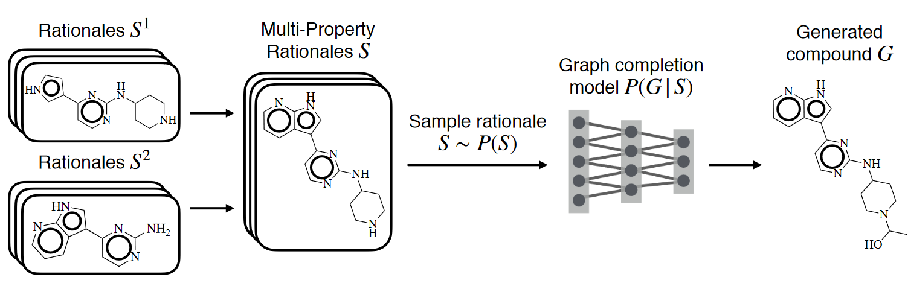

### Lego Intelligence: Constructing Neural Networks Instead of Learning Them

In AI for drug discovery, there is a beautiful but underappreciated method called [Rationales](https://arxiv.org/abs/2002.03244).
Say we want to generate novel molecules that have certain properties like drug-likeness and solubility.
Suppose we have a dataset of a few million molecules along with property predictors that take in molecules and output property scores.

What Rationales does is this: it uses Monte Carlo tree search to chip away at each molecule in our dataset, atom-by-atom, until it finds the smallest substructures that still retain a high score for each property.
These substructures are called _rationales_ and are meant to explain their respective properties when present in larger molecules.
Against the backdrop of traditional generative models, this is beautiful. It’s trying to find the most fundamental structures in our chemical world that correspond to different high level properties.

Now to generate a novel molecule that is soluble and drug-like, we take rationales for each property and overlap them at common atoms.
The resulting structure is a _multi-property rationale_.
We then pass this multi-property rationale to a denoising autoencoder to “expand” it into a full molecule.
This is by far the most elegant, interpretable method in drug discovery and is still SOTA. But it’s very different from standard models, so it’s very rare in practice.

I was thinking how I typically have as little understanding of how molecules achieve their tasks, like inhibiting proteins, as I have about how neural networks achieve their tasks, like generating jokes. Rationales was a nice break from that fog. It made it easier to interpret what was going on—both in the molecule itself and in the neural network.

Or did it? There are neural networks involved, i.e. the denoising autoencoder, but they are just as blackbox as always. All Rationales did was replace a process that is usually completely absorbed in neural networks with a different, more interpretable process. So Rationales made the process of generating molecules more interpretable, but didn’t do anything to explain the neural networks itself.

But could it? Neural networks are just big molecules, after all (/joke). But they _are_ both graphs. Could we define property predictors on neural networks, like “detects jokes” and “identifies banana skin”, like we did with molecules? Could we use the same method to find minimal substructures that still retain high property scores? Could we then combine these neural rationales into overlapping multi-property rationales? Could we then expand our neural multi-property rationales into full neural networks like we expanded molecular multi-property rationales into full molecules? If we could do this, just like we had a way to construct molecules from interpretable building blocks of molecular rationales, we’d have a way to construct neural networks from interpretable building blocks of neural rationales.

The general picture seems plausible but the setup is very foreign. How would we get a big set of neural networks analogous to our big set of molecules? How would we define property predictors on them? What would the substructures, the neural rationales, represent?

If a neural network has properties like “detects jokes” and “identifies banana skin”, what would it mean for its substructures to have those properties too? I think the best framework to look at this is Circuits, described [here](https://distill.pub/2020/circuits/zoom-in/) and [here](https://distill.pub/2020/circuits/early-vision/). Circuits are defined as connected subgraphs of neural networks that represent meaningful transformations between features. They encode algorithms that, when looked at under a microscope, can often be meaningfully understood. Then the neural rationales we aim to find would be circuits. And for a circuit to have a property like “detects jokes” would mean that it has features that activate when a joke is observed. Our neural property predictors can then be supervised loss functions on the final layers of these circuits, analogous to our molecular property predictors.

But to build a library of neural rationales, we need to start with a big set of neural networks that have a big, diverse set of circuits that realize a big, diverse set of properties. Where do we get a set like that? This is where the road ahead seems to fork.

One idea is to train lots of neural networks on lots of different tasks, which each involve learning lots of different circuits that manifest lots of different properties. If the universality thesis of Circuits is true, our rationales should all rest on a set of common motifs, making it easy to compare and combine them.

However, if different tasks result in very different circuits, weights, representations, and features, it would be very difficult to compare and combine the rationales we discover. This seems like a very plausible outcome.

Do we need a set of a million neural networks to get a big, diverse set of circuits? What else, besides a set of a million neural networks, contains a big, diverse set of circuits? Well, a single massive neural network can too. Large language models like [GPT-3](https://arxiv.org/pdf/2005.14165.pdf) are able to detect and generate jokes, emotions, facts, attributions, and ownerships of anything from cats to quarks, each of which may involve hundreds of circuits or more. A single large model can contain the diversity of rationales for the diversity of properties that we need. While we won’t naturally find the molecular equivalent of GPT-3, here it’s different. We can _learn_ a single neural network and guarantee it will be a source of lots of rationales for every property we’re interested in. Now our single, large, generally intelligent model can be the source of building blocks for constructing smaller more specific neural networks.

To extract rationales from large neural networks, we may need a more clever strategy than how Rationales uses Monte Carlo tree search. The tree might have billions of nodes and chipping away at them to find minimal substructures seems highly inefficient. Instead, we can try to find substructures by initializing tree search at input nodes and expanding them deeper and wider into the network until they find minimal substructures with the desired property scores.

Once we have a library of neural rationales, it’s time to put them together. Unlike molecular rationales, we can’t just overlap them at a common node. Instead, we need an algorithm that can take a set of subgraphs and weave them together into a coherent whole graph. The construction step of molecular Rationales has two parts: (1) overlap the rationales to form a multi-property rationale (2) pass them through a VAE to expand them into a molecule. For neural rationales, we should instead pass the set of single-property rationales through a subgraphs-to-graph translation system to “expand” them into a whole neural network.

If this works, we will have an interpretable procedure for constructing small, task-specific neural networks. Instead of needing to train small neural networks on curated datasets and worrying about their generalization and interpretability, we could instead weave together meaningful building blocks from large, generally intelligent models. Is this actually possible? I have no idea. I would love to work with the people who do, though, and develop the ability and experience to find out.
