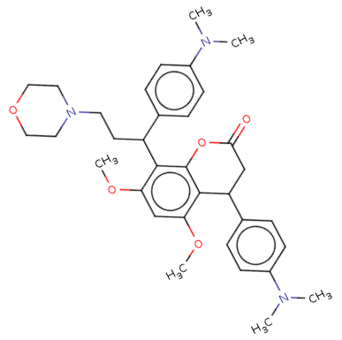
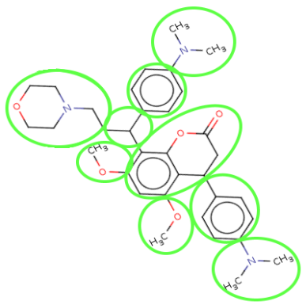
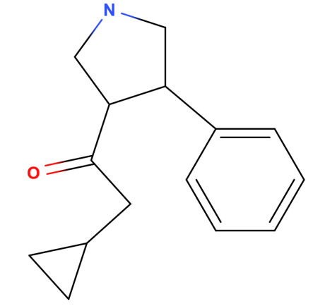
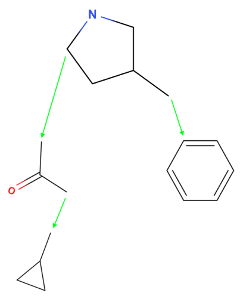
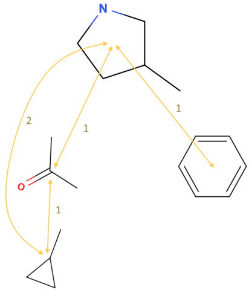

### **State-of-the-Art Molecular Autoencoders From Scratch**

### **Motivation**

I’ve been thinking a lot about how to automatically synthesize graphs like molecules and social systems. Many successful approaches use neural networks to embed graphs into a continuous space, then search through it using anything from particle swarms to bayesian optimization. If you want to learn more about latent spaces and how to search them for high quality molecules, I wrote about that in more detail [here](noncomputable.github.io/evolution), where I developed a way to augment traditional search strategies with evolutionary algorithms.

But however good our search strategy is, the results we get will only be as good as the quality of the embeddings. If smoothly moving between two points in latent space doesn’t correspond to smoothly moving between the properties of two graphs, we’ll have a very hard time optimizing our objectives.

There are lots of ways to embed molecules into a latent space, like [this](https://arxiv.org/pdf/2004.01215.pdf), [this](https://arxiv.org/pdf/1703.01925.pdf), [this](https://pubs.rsc.org/no/content/articlehtml/2019/sc/c8sc04175j), [this](http://proceedings.mlr.press/v80/jin18a/jin18a.pdf), [this](https://jcheminf.biomedcentral.com/articles/10.1186/s13321-019-0397-9), [this](https://arxiv.org/pdf/1805.11973.pdf), [this](https://arxiv.org/pdf/2002.03230.pdf), and a bunch more. I wanted a VAE that could translate between arbitrary molecules and their embeddings, but the most successful methods involved lots of moving parts that were difficult to motivate and expand upon.

Whenever I study something, I wonder “how could I have come up with this from scratch?”, and that was hard to answer staring at these papers. In deep learning, so many methods are inscrutably complex yet empirically effective to the point that even their authors aren’t sure why they work. So I wouldn’t be surprised if my attitude was counterproductive. But having spent hundreds of hours pouring through and implementing these papers, many of those moving parts fell into place and the intellectual path from the simplest method to the best method became straightforward.

Let's explore how we could have come up with a variation on the [HierGraphVAE](https://arxiv.org/pdf/2002.03230.pdf), invented (or discovered?) by Wengong Jin, Tommi Jakkola, and Regina Barzilay.

### **The Naive Approach**

We want to build a molecular autoencoder. How can we do that?

Well, we can think of molecules as graphs of atoms and bonds. We can try to take one of these graphs and encode it into a continuous embedding. Then we can take that embedding and try to decode it back into a molecular graph, say by turning the embedding into a sequence of instructions like “add a carbon → add a new carbon → double bond it to the first carbon → add a new oxygen → double bond it to the second carbon → .... → stop”.

#### **Encoder**

If we have a molecular graph, how would we actually encode information about its structure and content into a single, low-dimensional vector?

The first idea that comes to mind is to use a simple message-passing network. Each atom messages an embedding of its type (encoding its charge, atomic number, etc.) to its neighbors. Then each atom pools these messages along with its own embedding to get a new, neighborhood-aware representation. If we repeat this process for a few steps, our nodes will encode information about the structure and content of the graph around them. Let’s call this message-passing network _AtomMPN_.

Once message-passing is finished, we can pool all the nodes to get a meaningful embedding for the entire molecule, _Z_.

#### **Decoder**

Once we have _Z_, we can use it to make a sequence of decisions to construct a new molecular graph. At the first step, when the graph is empty, we’ll pass _Z_ through a multilayer perceptron, _AtomMLP,_ that outputs a probability distribution over the possible atom types plus a “stop” signal. We’ll sample an atom type and add the first atom to the new graph.

Then each step will look like this:

First we’ll pass _Z_ through _AtomMLP_ to get a new atom.

Then we’ll pass _Z_, the new atom, and all the atoms already in the graph through a _NeighborMLP_ which outputs a probability distribution over the atoms already in the graph, plus a “stop” signal. We sample one of these atoms to be the new atom’s neighbor. 

Finally, we’ll pass _Z_, the new atom, and the neighbor atom to a _BondMLP_ that outputs a distribution over bond types. We’ll sample a bond type and add an edge of that type between the new atom and the sampled neighbor atom.

Then, to let this decision influence the model’s next decision, we should run the graph through our _AtomMPN_ to update the atoms with information about their new neighbors.

We’ll keep trying to bond the new atom to existing atoms until _NeighborMLP_ gives the stop signal. Finally, once _AtomMLP_ outputs its stop signal, we’ve got our final molecule.

#### **Training**

We can traverse each molecule in our training set and use each step of the traversal (“go from atom type A to atom type B along bond type C”) to generate a sequence of target decisions. Then, every time the decoder outputs a distribution of atom types, bond types, or neighbors, we can record the loss as the negative log likelihood of the target decision. Summing all these losses together, we can run the usual training routine and learn a model that’s good at encoding and decoding molecules.

After fiddling with the hyperparameters and trying different variations on the MPN, it works quite well!

### **Oh No**

But… performance drops severely as molecules grow in size. No variation of GCNs and GATs and MLP layers seems to make it much easier.

I guess it’s hard to encode the structure of many of atoms bonded together in different ways into a reasonably sized vector space. If we think about it, it makes sense: while the number of atom types and bond types stays constant, the number of possible ways to bond the atoms of a molecule—or the distinct decision sequences that generate those bonds—is a superfactorial function of the number of atoms:

Suppose that instead of being able to bond to any number of atoms in the graph, we only let a new atom bond to _one_ other atom at that step. A severe restriction. Then the total number of possible bonding arrangements would be 1 at step 1 × 2 at step 2 × … × 49 at step 49 × 50 at step 50. A 50 atom graph would have ~ 3 × 10^64 or “30 vigintillion” possible bonding arrangements.

Remember that the new atoms can actually bond to more than one atom per step, multiply that by the number of atom types and edge types, and it seems _very_ hard to pack all that information into a little vector space and a few tractable decoder functions. And that intuition looks right: our model finds it impractically hard to encode bigger molecules into a low-dimensional embedding and decode those embeddings back into the original molecules.

Not to mention that we want the decoder to be able to interpolate in the space between the molecules in our dataset, so that we can explore and generate completely new ones! A working VAE seems far away…

### **Beating the Complexity Piñata**

The problem is the explosive growth in the number of possible bonding arrangements as the molecules get bigger. How can we cut it down?

If we could reduce the number of nodes in the graphs, there would be fewer arrangements. But how could we construct the graph of all the nodes… without generating each of the nodes? Maybe larger graphs have a lot more redundancies? Can we skip a bunch of their atoms without an increase in error and fill in the gaps?

We could also decrease the number of arrangements by decreasing the number of possible neighbors for each new atom. But even if we only let each new atom choose exactly _one_ existing atom to bond to, the number of possibilities still grows factorially. And with that restriction, we can’t even construct cycles, and molecules tend to have lots of cycles! So how could it even be possible to decrease the number of possible neighbors below that?

Maybe if new atoms didn’t have to select a neighbor in the first place. That could happen, for example, if its sole neighbor in the graph thus far could always be guaranteed to be the last atom we generated before it. But that would generate a tree of atoms extending from the first one, and again, it can't even construct cycles. What to do?

### **A Dollop of Domain Knowledge**

You spin up a program to visualize all the molecules in our dataset and flick through them for hours.

Gradually, the sun rises, and you realize the molecules are all made out of common building blocks. _Not_ the atoms. But there are chunks—functional groups, rings glued to each other like mosaics, and so on—that appear over and over throughout the dataset. Now, there might be thousands of these chunks and some of them might be rare, but most of these molecules appear to be made out of chunks that are present in a bunch of other molecules too.

For example, take this molecule:

And we can see a few of the chunks that make it up:

We realize we can represent our molecules not just as a graph of atoms, but at a higher level, as a graph of these chunks. By representing our molecules as graphs of chunks rather than graphs of atoms, we can drastically reduce the number of nodes in our graphs, successfully implementing our first idea to reduce the complexity of bonding.

The question still stands: there are lots of ways to decompose a graph of atoms into chunks, how do we choose the particular chunks of our vocabulary?

Also, what about our second idea for reducing the complexity? Will these chunk-level graphs necessarily contain cycles just like their underlying atom-level graphs? I don’t want to take this assumption for granted. Is it possible for the chunk-level to be structured as a tree while retaining cycles at the atom-level?

Remember that one way to identify a tree is this: if you cut an edge, the graph splits into two disconnected parts.

Looking at the chunks in our molecules, we can see that _some_ chunks are connected to others in an interesting way: if you cut the bond connecting them, the molecule splits into two disconnected parts. This is called a _bridge_ bond. If we decompose a molecule into chunks with this property, we can represent it as a tree of chunks. That means, for every new chunk the decoder has to add, we can guarantee that its only neighbor in the graph thus far will be its parent in the tree, successfully implementing our second idea to reduce the complexity of bonding!

Further, we now have a precise way of decomposing any molecule into chunks: find a bridge bond, detach it from one end, and if one of the newly disconnected components is free of bridge bonds, treat it a special chunk called a _motif_. Otherwise, repeat the same process and decompose the remaining non-motif chunks into motifs. In the end, we will have constructed a tree of motifs, whose root is the first motif we found. Each motif will have been split off of exactly one other motif, its parent in the tree, and may have one or more motifs split off from it, its children.

With this, our graphs have fewer nodes overall, and each new node has a single guaranteed neighbor.

Wow, we cut the complexity of bonding down and lit it on fire. Now we should be able to generate molecules without the pitfalls of our first, naive approach.

### **The Motif Autoencoder**

We want to build an autoencoder for graphs of motifs, just like we did for graphs of atoms. How can we do that?

We take our dataset, translate all our molecules from graphs of atoms into graphs of motifs, and build a vocabulary of motif types. We’ll associate each motif type in our vocabulary with a learnable embedding.

#### **Encoder**

Just like before, we can embed the entire graph into our latent space by passing it through an MPN for a few steps and pooling its node embeddings together. When we were dealing with atom graphs that didn’t have a strict, consistent structure, the most obvious way to encode the structural role of a node during message-passing was to just pool its neighbors together.

But there’s something special about the structure of these motif-level graphs: they’re trees. We have a root, and children pointing out of the root, and grandchildren pointing out of those children, and so on. Unlike a less structured graph where a node 5 nodes away may or may not have anything to do with a target node, in a tree we know for a fact: the generation of our target node depends directly on its 5th ancestor and all the ancestors between them. It makes sense that a node should be able to communicate with its entire chain of ancestors and descendants in a graph structured like this. We should let this happen.

The solution is simple: we can just add _ancestry edges_ between each motif and its ancestors and descendants. But it also seems problematic to have a motif communicate with its great-great-grandparent in the same way it communicates with its parent. To inform message-passing about the relationship between 2 nodes, we can label each of these ancestry edges with the actual distance between the motifs. We’ll call this the _MotifMPN_.

For example, take this molecule:

It can be decomposed into a tree of motifs like this:

But instead of passing messages along the green edges where the motifs are attached, we will pass them along _ancestry edges_ pictured and labeled in gold:

Now, after a few steps of message-passing, we might pool all the ancestry-aware motif representations together to get an embedding for our entire motif-level graph. But… I feel there’s gonna be a big imbalance in the representations of these nodes: at one extreme, leafs will only ever exchange messages with motifs in their single line of ancestry; at the other extreme, the root will exchange messages with _every motif in every line of ancestry in the graph_. In a sense, information from all the motifs is being pooled into the root motif. Yet if I average or aggregate all the motifs together, they’ll all be forced to contribute equally.

Since information from everywhere in the graph is being propagated into the root motif anyway, we can try to learn an encoder and decoder such that the entire graph can be reconstructed from just the root. So, instead of pooling the nodes in the usual way, the final representation of the root motif will be our graph embedding _Z_.

#### **Decoder**

At the first step, when the graph is empty, we can get our first motif by passing _Z_ through a _MotifMLP_ that outputs a probability distribution over motif types. We’ll sample one and add the first motif to the new graph. We’ll keep track of the motifs that still have descendents that need to be added in a stack, _MotifStack_, and push the first motif onto it.

Then, each step will look like this:

First, we’ll run the _MotifMPN_ to get ancestry-aware representations for all the motifs. We’ll pass _Z_ and the motif at the top of _MotifStack_ through _MotifMLP_ to get a new motif to add as its child.

We’ll attach the new motif to the parent by taking a pair of atoms of the same type from each motif and merging the motifs together at those atoms. To do that, we can pass _Z_, the new motif, and the parent motif to an _AttachmentMLP_ that outputs a probability distribution over pairs of atoms from the parent and child with the same type and sample a pair.

However, since the new motif hasn’t yet been incorporated into the graph, all atoms of the same type will have the _same exact_ embeddings, i.e. each carbon will be indistinguishable from each other carbon. Thus _AttachmentMLP_ will be unable to distinguish between attachments at different atoms of the same type. But we know atoms of the same type can play very different roles. So how can we transform the atom embeddings to capture these differing roles? By running them through our AtomMPN, which does just that! By doing this before attaching a motif, the decoder will be able to distinguish attachments of the same type by their structural roles.

After making this attachment, if the parent motif doesn’t have any atoms left to attach, we pop it off _MotifStack_. Finally, we push the new motif onto the stack and start adding its descendants in the next step.

### **Motifs, Alone?**

Our model has to learn useful representations for the motifs just from their connections to each other. But we know the structure of these motif-level graphs is completely determined by strict chemical laws, by the atoms and bonds underlying them. So I think it may make it easier to learn useful representations if we inform each motif node with the graph of atoms that defines it.

To do this for a molecule, first we’ll pass the atom-level graph through our MPN. Then we’ll get an atom-level representation of each motif by pooling the atoms inside each motif together. Then, we’ll pass the motif’s embedding along with its atom-level representation through an MLP to get an _atom-informed_ representation of the motif. Finally, we’ll pass this atom-informed tree of motifs through our encoder to get an atom-informed embedding of the entire molecule.

Feeding subgraphs at the atom-level into nodes at the motif-level makes this approach _hierarchical_.

### **Motifs and Atoms, Alone?**

#### **Decoder**

We test our model and find that it performs well for larger molecules… but just like our first approach, there’s a severe decrease in performance as the molecules grow. Especially when their motifs are large. What’s going on? Our problem was that the number of possible bonding decisions grew factorially with the number of atoms. Is there an analogous issue with our new model?

The analogous part of our new model is our attachment decisions, i.e. choosing the pair of atoms where the new motif and its parent will attach. What’s going on there?

I imagine a molecule where each motif has 5 carbon atoms. Each step will have to choose between 5 × 5 = 25 possible attachment pairs. If our molecule has 10 motifs, the number of possible decision chains is 1 at step 1 × 25 at step 2 × 25 at step 3 × … × 25 at step 9 × 25 at step 10. That’s 3 × 10^12 possibilities for 50 atoms. Still a lot more efficient than our naive approach, but it’s clear why it will still be very difficult to encode larger molecules. Is there a way to reduce the number of possible attachments per step?

We gaze at our dataset again and notice that the attachments aren’t totally random. There’s a pattern to them. For example, a motif may attach at two carbons on opposite sides a quarter of the time, another quarter of the time it may attach at only one nitrogen, and it may attach at all three of those atoms the rest of the time. We’ll call each of these patterns _attachment configurations_. If we associate each motif in the molecule with an attachment configuration, we don’t have to check every pair of atoms between two motifs, just the ones in their selected attachment configurations.

So, instead of predicting a pair of atoms to attach immediately after predicting a new motif, we can first predict the new motif’s attachment configuration. So instead of looking at all 5 × 5 = 25 pairs of atoms from each motif, we can just look at the 2 × 3 = 6 pairs of atoms from each motif’s attachment configuration. To this end, we’ll add a new _AttachmentConfMLP_ to our decoder that accepts _Z_, the parent motif, and the new motif as input, and outputs a distribution over the new motif’s possible attachment configurations. Then, we sample an attachment configuration and predict a pair of attachment atoms, constrained by the attachment configurations of the new motif and the parent motif.

With this, we’ve cut down the complexity of our task even more, and our model should be equipped to handle molecules of practically any size!

#### **Encoder**

So far, the motif representations are defined by the atoms+bonds inside the motifs and by the connections between the motifs. But when motifs send messages to each other, they actually have no information about _where_ they are attached, only the bare fact _that_ they have some attachment somewhere. Could it be useful to inform our motifs with information about the specific way in which they’re attached?

We can create another graph of the motifs’ attachment configurations connected in the same way as the motifs and pass it through our MPN to get embeddings for each attachment config. Then, just like we fed embeddings of the atoms-and-bonds into their motifs, we can feed the attachment configs into their respective motifs to get attachment config-informed motif representations.

But now we’re feeding both the atom-level graphs and the attachment config-level graphs into the motifs simultaneously. Supposedly, we’re concatenating them. But since each motif node is associated with its lone attachment config node, the attachment config level is “coarser” than the atom level. So it would make sense to put the atom-level graphs lower in the hierarchy than the attachment configs, rather than at the same level.

To do that for each motif, we can get an atom-level embedding, feed that atom-level embedding to its attachment config to get an atom-informed embedding of the motif’s attachment config, and feed that into the motif-level to get an embedding of the motif informed by all lower levels.

Adding this attachment configuration level to the hierarchy between the atoms and the motifs substantially improves the performance of our autoencoder.

### **Wrapping Up**

After lots of thought, exploration, and experimentation, we ended up somewhere far from the naive approach we began with. The paper reports HierGraphVAE's reconstruction accuracy side-by-side with other methods:

<table>
<thead>
  <tr>
    <th>Method</th>
    <th>Reconstruction Accuracy</th>
  </tr>
</thead>
<tbody>
  <tr>
    <td>SMILES-VAE</td>
    <td>21.5%</td>
  </tr>
  <tr>
    <td>JT-VAE</td>
    <td>42.4%</td>
  </tr>
  <tr>
    <td>GC-VAE</td>
    <td>58.5%</td>
  </tr>
  <tr>
    <td>HierGraphVAE</td>
    <td>79.9%</td>
  </tr>
</tbody>
</table>

This model turns out to outperform every other molecular autoencoder I’ve seen til now, and there are good theoretical reasons to expect it to outperform for other tasks on larger graphs. 

And now, we can fly our bayesian rocket ship through latent space and explore its habitable (er, high QED) depths.
